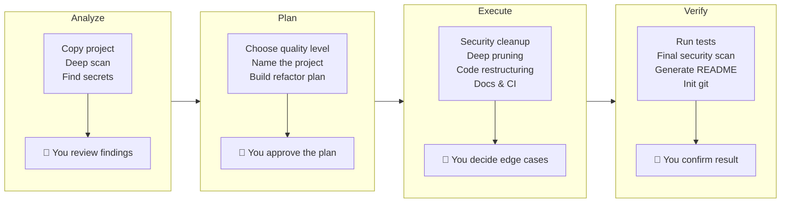

<p align="center">
  
</p>

<h1 align="center">all-project-auto-to-opensource</h1>

<p align="center">
  <b>Turn any messy codebase into a polished, production-grade project — in one shot.</b>
</p>

<p align="center">
  <a href="README.md">English</a> | <a href="README_CN.md">中文</a>
</p>

---

You have a project that works. Maybe it started as a prototype, maybe it grew organically. Now it's full of dead code, test files nobody reads, hardcoded paths, leaked credentials, and a folder structure that makes no sense.

You want to clean it up — maybe open-source it, maybe just make it maintainable. But the gap between "it works on my machine" and "anyone can pick this up" is enormous.

**This AI Skill closes that gap automatically.**

## What It Actually Does

Give it any project — any language, any framework — and it will:

- **Strip what doesn't belong** — unused files, dead code, internal-only utilities, test fixtures that reference your company
- **Find what shouldn't be public** — API keys, tokens, private IPs, employee names, hardcoded paths — across every file, including the ones you forgot about
- **Restructure to industry standards** — proper directory layout, clean imports, sensible naming, LICENSE, CONTRIBUTING, CI config
- **Generate documentation from the final result** — README, API docs, architecture overview — written from *what the code actually is*, not what you think it is
- **Verify everything** — tests must pass, security scan must be clean, before anything is finalized

The result: a project that looks like it was built by a disciplined team from day one.

## Who Is This For

| Scenario | What You Get |
|----------|-------------|
| **"I want to open-source my side project"** | Secrets removed, code pruned, README generated, ready to publish |
| **"This internal tool is a mess"** | Dead code gone, structure normalized, maintainability up |
| **"I inherited a codebase"** | Understand what matters, strip what doesn't, get a clean starting point |
| **"My demo needs to become a real product"** | From prototype chaos to production structure in minutes |

## Installation

```bash
npx skills add breath57/all-project-auto-to-opensource/skills/en
```

## How It Works

The skill runs an 8-phase workflow with 5 mandatory checkpoints — you stay in control of every critical decision.



### 3 Quality Levels

| Level | Scope | Best For |
|-------|-------|----------|
| **L1 Basic** | Security cleanup + LICENSE + README + .gitignore | Quick release, internal tools |
| **L2 Standard** | L1 + code cleanup + tests + CI + CONTRIBUTING | Most projects |
| **L3 Professional** | L2 + API docs + architecture docs + examples + badges | Libraries, frameworks |

### What the AI Never Does Without You

At every checkpoint, the AI stops and waits:

1. **Analysis** — shows what it found (secrets, dead code, internal references). You decide what's real.
2. **Level & naming** — you pick L1/L2/L3 and the project name.
3. **Refactor plan** — you see exactly what will change before it happens.
4. **Edge cases** — files it's unsure about? You decide keep or remove.
5. **Final review** — tests pass, scan is clean, you confirm before it writes the README.

## Security

- Multi-layer secret scanning — API keys, tokens, passwords, connection strings, cloud credentials, PEM certificates
- Internal reference detection — corporate URLs, private IPs, hardcoded paths, employee names
- .gitignore-aware — won't delete files already protected
- Double verification — full security scan runs again after all changes

## Contributing

Issues, improvements, and feature requests are welcome.

## License

MIT — see [LICENSE](LICENSE).
