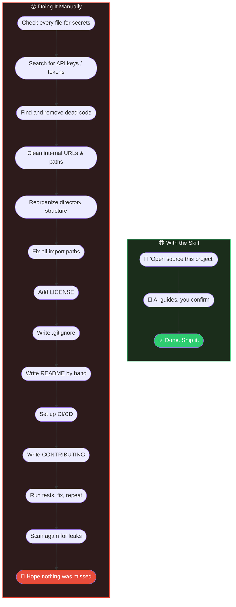

<p align="center">
  
</p>

<h1 align="center">all-project-auto-to-opensource</h1>

<p align="center">
  <b>Turn any messy codebase into a polished, production-grade project — in one shot.</b>
</p>

<p align="center">
  <a href="README.md">English</a> | <a href="README_CN.md">中文</a>
</p>

---

You have a project that works. Maybe it started as a prototype, maybe it grew organically. Now it's full of dead code, test files nobody reads, hardcoded paths, leaked credentials, and a folder structure that makes no sense.

You want to clean it up — maybe open-source it, maybe just make it maintainable. But the gap between "it works on my machine" and "anyone can pick this up" is enormous.

**This AI Skill closes that gap automatically.**

## ⚡ The Difference



## What It Actually Does

Give it any project — any language, any framework — and it will:

- **Strip what doesn't belong** — unused files, dead code, internal-only utilities, test fixtures that reference your company
- **Find what shouldn't be public** — API keys, tokens, private IPs, employee names, hardcoded paths — across every file, including the ones you forgot about
- **Restructure to industry standards** — proper directory layout, clean imports, sensible naming, LICENSE, CONTRIBUTING, CI config
- **Generate documentation from the final result** — README, API docs, architecture overview — written from *what the code actually is*, not what you think it is
- **Verify everything** — tests must pass, security scan must be clean, before anything is finalized

The result: a project that looks like it was built by a disciplined team from day one.

## Who Is This For

| Scenario | What You Get |
|----------|-------------|
| **"I want to open-source my side project"** | Secrets removed, code pruned, README generated, ready to publish |
| **"This internal tool is a mess"** | Dead code gone, structure normalized, maintainability up |
| **"I inherited a codebase"** | Understand what matters, strip what doesn't, get a clean starting point |
| **"My demo needs to become a real product"** | From prototype chaos to production structure in minutes |

## Installation & Usage

### 1. Install

```bash
npx skills add breath57/all-project-auto-to-opensource/skills/en
```

### 2. Trigger

After installing, tell your AI coding assistant (e.g. Cursor) on any project:

> **"Open source this project"**

Other triggers: `"opensource"`, `"prepare for open source"`, `"make it open source"`

### 3. Follow the flow

The skill starts a guided process automatically:

1. **Copy** — works on a copy; your original code is never touched
2. **Scan** — finds secrets, dead code, internal references, redundant files
3. **Ask you** — stops at every critical decision and waits for your call
4. **Clean & restructure** — executes the plan you approved
5. **Verify** — tests pass + security scan clean, then generates README and docs
6. **Deliver** — you get a project with clean structure, no secrets, and complete documentation

### What You End Up With

- Clean code — no dead code, no internal-only logic, no abandoned files
- Secure repo — API keys, tokens, private IPs all removed
- Standard structure — directory layout, naming, imports follow industry conventions
- Complete setup — LICENSE, README, .gitignore, CI, CONTRIBUTING out of the box
- Documentation from final code — not a copy-pasted template, but docs that reflect the actual state of the code

## Security

- Multi-layer secret scanning — API keys, tokens, passwords, connection strings, cloud credentials, PEM certificates
- Internal reference detection — corporate URLs, private IPs, hardcoded paths, employee names
- .gitignore-aware — won't delete files already protected
- Double verification — full security scan runs again after all changes

## Contributing

Issues, improvements, and feature requests are welcome.

## License

MIT — see [LICENSE](LICENSE).
