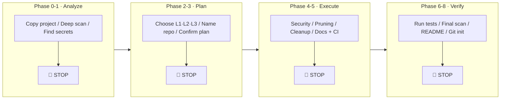
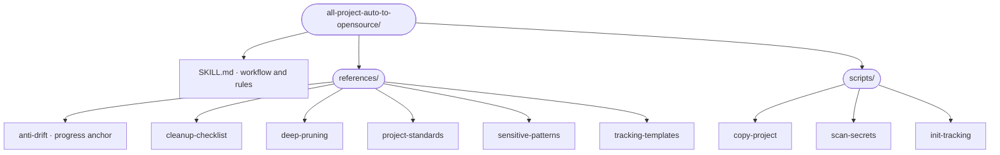

# 🚀 all-project-auto-to-opensource

**Transform any private project into a production-ready open source project — automatically.**

[English](README.md) | [中文](README_CN.md)

---

> One AI skill. Any language. Any framework. From private repo to polished open source in minutes, not days.

## ✨ What Makes This Different

Most "open source checklist" tools give you a static list of things to check. This skill **actively does the work for you** through your AI coding assistant:

- 🔒 **Security-first** — Automatically scans and cleans secrets, API keys, internal URLs, hardcoded paths
- 🧹 **Deep pruning** — Doesn't just remove `.DS_Store`. Goes file-by-file, function-by-function to strip internal-only code
- 🤖 **8-phase guided workflow** — With 5 mandatory checkpoints where YOU make the decisions
- 🌍 **Language-agnostic** — Python, Node.js, Rust, Go, Java, Ruby... if it's code, it works
- 📊 **Never loses track** — Persistent progress bar + JSON tracking files prevent the AI from drifting
- ✅ **Test-driven** — Every change is verified. Tests must pass before moving on
- 📝 **README last** — Generates README from the *final* code, not from outdated assumptions

## 🎯 The Problem

Open-sourcing a private project is tedious and error-prone:

- Did I remove all hardcoded API keys? What about that one in the test fixture?
- Is there internal-only code hiding in a utility function somewhere?
- Does the README actually match the final state of the code?
- Did I forget the LICENSE file? CONTRIBUTING.md? .gitignore?

**This skill handles all of it** — systematically, thoroughly, with human checkpoints for every critical decision.

## 📦 Installation

```bash
npx skills add breath57/all-project-auto-to-opensource/skills/en
```

## 🔄 How It Works



### 3 Target Levels

| Level | What You Get | Best For |
|-------|-------------|----------|
| **L1 Basic** | Security cleanup + LICENSE + README + .gitignore | Quick release, internal tools |
| **L2 Standard** | L1 + code cleanup + tests + CI + CONTRIBUTING | Most projects |
| **L3 Professional** | L2 + API docs + architecture docs + examples + badges | Libraries, frameworks |

### 5 Mandatory Checkpoints

The AI **never** makes critical decisions for you. At each 🛑 STOP point, it presents findings and waits for your confirmation:

1. **Analysis Report** — Review what was found before proceeding
2. **Level & Name** — Choose target level and project name
3. **Refactor Plan** — Approve the detailed plan before execution
4. **Uncertain Items** — Decide what to keep/remove for unclear files
5. **Test Results** — Verify everything passes before README generation

## 📁 Skill Structure

In this repository, this skill lives under `skills/en/all-project-auto-to-opensource/`:



## 🚀 Quick Start

1. **Install the skill:**
   ```bash
   npx skills add breath57/all-project-auto-to-opensource/skills/en
   ```

2. **Tell your AI assistant:** e.g. “open source this project”, “prepare for open source” (see triggers in `SKILL.md`).

3. **Follow the guided workflow** — The AI will:
   - Copy your project (never modifies originals)
   - Deep-scan for secrets, internal code, dead code
   - Present findings and wait for your decisions
   - Execute the approved plan with continuous testing
   - Generate a polished README based on the final result

## 🛡️ Security Features

- **Multi-layer secret scanning** — API keys, tokens, passwords, connection strings, cloud provider keys, PEM certificates
- **Internal reference detection** — Corporate URLs, private IPs, hardcoded paths, employee names
- **.gitignore-aware** — Won't delete files already protected by .gitignore
- **Double verification** — Runs security scan again after all changes, before final review

## 🤝 Contributing

Improvements to references and scripts, issues, and feature requests are welcome.

## 📄 License

MIT License — see [LICENSE](LICENSE).

---

<p align="center">
  <b>Stop worrying about what you forgot to clean up. Let the skill handle it.</b>
</p>
