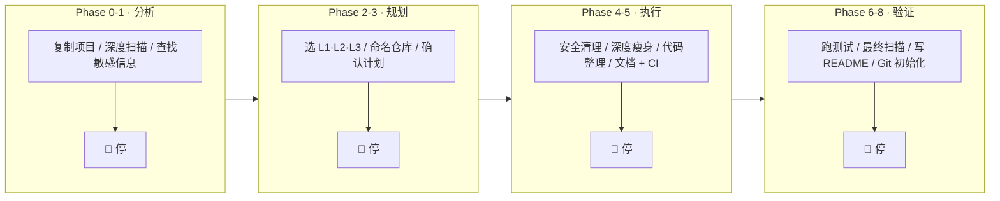
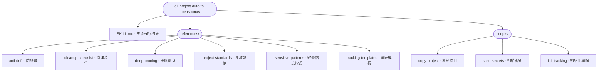

# 🚀 all-project-auto-to-opensource

**将任何私有项目自动转化为生产级开源项目。**

[English](README.md) | [中文](README_CN.md)

---

> 一个 AI Skill，任何语言，任何框架。从私有仓库到精打细磨的开源项目，分钟级完成。

## ✨ 与众不同之处

大多数"开源检查清单"工具只给你一个静态列表。这个 Skill **通过你的 AI 编程助手主动帮你完成所有工作**：

- 🔒 **安全优先** — 自动扫描并清理密钥、API Key、内部 URL、硬编码路径
- 🧹 **深度瘦身** — 不只是删除 `.DS_Store`。逐文件、逐函数剥离内部专用代码
- 🤖 **8 阶段引导工作流** — 5 个强制检查点，所有关键决策由你做主
- 🌍 **语言无关** — Python、Node.js、Rust、Go、Java、Ruby... 只要是代码就能用
- 📊 **从不丢失进度** — 持久化进度条 + JSON 追踪文件，防止 AI 跑偏
- ✅ **测试驱动** — 每次修改都验证，测试必须通过才能继续
- 📝 **README 最后写** — 基于*最终代码*生成 README，而不是过时的假设

## 🎯 解决什么问题

开源一个私有项目既繁琐又容易出错：

- API 密钥都清理干净了吗？测试 fixture 里那个呢？
- 某个工具函数里是不是藏着内部专用代码？
- README 真的匹配代码的最终状态吗？
- LICENSE 文件加了吗？CONTRIBUTING.md 呢？.gitignore 呢？

**这个 Skill 全部搞定** — 系统化、深度化，每个关键决策都有人工检查点。

## 📦 安装

```bash
npx skills add breath57/all-project-auto-to-opensource/skills/cn
```

## 🔄 工作原理



### 3 个目标级别

| 级别 | 包含内容 | 适用场景 |
|------|---------|---------|
| **L1 基础** | 安全清理 + LICENSE + README + .gitignore | 快速发布、内部工具 |
| **L2 标准** | L1 + 代码整理 + 测试 + CI + CONTRIBUTING | 大多数项目 |
| **L3 专业** | L2 + API 文档 + 架构文档 + 示例 + 徽章 | 库、框架 |

### 5 个强制检查点

AI **永远不会**替你做关键决策。在每个 🛑 停止点，它会呈现发现并等待你的确认：

1. **分析报告** — 审查发现结果后再继续
2. **级别和命名** — 选择目标级别和项目名称
3. **重构计划** — 批准详细计划后再执行
4. **不确定项** — 对不明确的文件决定保留/删除
5. **测试结果** — 确认全部通过后再生成 README

## 📁 Skill 结构

本仓库中本 Skill 位于 `skills/cn/all-project-auto-to-opensource/`：



## 🚀 快速开始

1. **安装 Skill：**
   ```bash
   npx skills add breath57/all-project-auto-to-opensource/skills/cn
   ```

2. **告诉你的 AI 助手：** 例如「帮我把这个项目开源」「准备开源」等（以 `SKILL.md` 中的触发说明为准）

3. **跟随引导工作流** — AI 会：
   - 复制你的项目（绝不修改原始项目）
   - 深度扫描密钥、内部代码、死代码
   - 呈现发现结果并等待你的决策
   - 按批准的计划执行，持续测试验证
   - 基于最终结果生成精美 README

## 🛡️ 安全特性

- **多层密钥扫描** — API 密钥、令牌、密码、连接字符串、云服务商密钥、PEM 证书
- **内部引用检测** — 企业 URL、私有 IP、硬编码路径、员工姓名
- **感知 .gitignore** — 不会删除已被 .gitignore 保护的文件
- **二次验证** — 所有修改完成后、最终审查前，再次运行安全扫描

## 🤝 贡献

欢迎改进参考文档与脚本、提交 Issue 与功能建议。

## 📄 许可证

MIT 许可证 — 详见 [LICENSE](LICENSE)。

---

<p align="center">
  <b>别再担心忘了清理什么，让 Skill 帮你搞定。</b>
</p>
