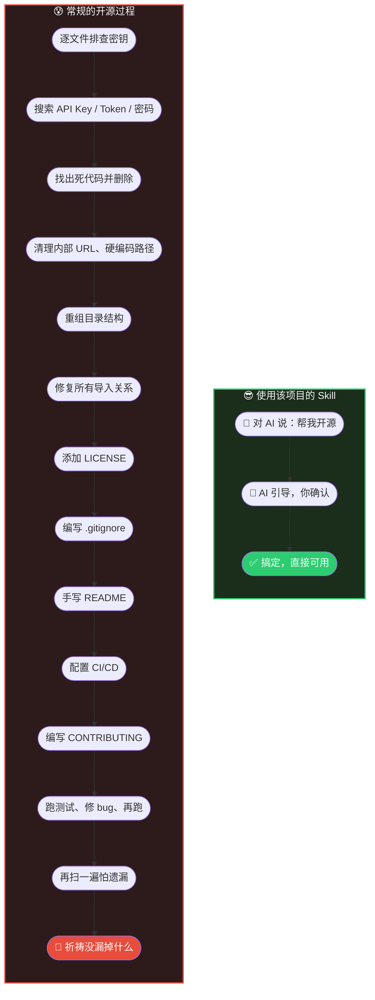

<p align="center">
  
</p>

<h1 align="center">自动转换项目为开源项目</h1>

<p align="center">
  <b>自动、轻松地转换任意项目为开源级别。</b>
</p>

<p align="center">
  <a href="README.md">English</a> | <a href="README_CN.md">中文</a>
</p>

---

你有一个能跑的项目。也许它从 demo 开始，也许是一点点长出来的。现在里面堆满了死代码、没人看的测试文件、写死的路径、泄露的密钥，文件夹结构也一塌糊涂。

你想把它收拾干净——也许要开源，也许只是想让它好维护。但从「在我这能跑」到「别人也能上手」，中间的鸿沟巨大无比。

**这个 AI Skill 帮你自动跨过这道鸿沟。**

## ⚡ 区别在哪



## 它到底做什么

给它任何项目——任何语言、任何框架——它会：

- **剥掉不该有的东西** — 废弃文件、死代码、仅内部使用的工具函数、引用了公司内部资源的测试数据
- **找出不能公开的东西** — API 密钥、令牌、内网 IP、员工姓名、写死的路径——遍历每个文件，包括你忘了的那些
- **按行业标准重构** — 规范的目录结构、干净的导入关系、合理的命名、LICENSE、CONTRIBUTING、CI 配置
- **基于最终代码生成文档** — README、API 文档、架构说明——写的是*代码实际的样子*，不是你以为的样子
- **全程验证** — 测试必须通过、安全扫描必须干净，才会进入下一步

最终结果：你的项目看起来像是一个有纪律的团队从第一天就在认真做。

## 适合谁

| 场景 | 你会得到什么 |
|------|------------|
| **「我想把副业项目开源」** | 密钥清除、代码精简、README 自动生成，直接可以发布 |
| **「这个内部工具太乱了」** | 死代码清理、结构规范化，可维护性大幅提升 |
| **「我接手了一个代码库」** | 搞清楚哪些有用、剥掉哪些没用，得到一个干净的起点 |
| **「我的 demo 要变成正式产品」** | 从原型混乱到生产级结构，分钟搞定 |

## 安装与使用

### 1. 安装

```bash
npx skills add breath57/auto-convert-project-to-open-source/skills/cn
```

### 2. 触发

安装后，在你的 AI 编程助手（如 Cursor）中对任意项目说：

> **"帮我把这个项目开源"**

其他触发方式：`"开源"`、`"开源化"`、`"重构为开源项目"`、`"prepare for open source"`

### 3. 跟着走

Skill 会自动启动引导流程：

1. **复制项目** — 在副本上操作，原始代码不受任何影响
2. **扫描** — 找出密钥、死代码、内部引用、冗余文件
3. **征求你的意见** — 每个关键决策都会停下来问你，你说了算
4. **执行清理与重构** — 按你确认的方案动手
5. **验证** — 测试通过 + 安全扫描干净后，自动生成 README 和文档
6. **交付** — 你拿到的是一个结构清晰、安全干净、文档齐全的项目

### 你会得到什么

- 干净的代码 — 没有死代码、没有内部专用逻辑、没有废弃文件
- 安全的仓库 — 密钥、令牌、内网地址全部清除
- 规范的结构 — 目录布局、命名、导入关系符合行业标准
- 完整的配套 — LICENSE、README、.gitignore、CI、CONTRIBUTING 一步到位
- 基于最终代码的文档 — 不是复制粘贴的模板，而是反映代码实际状态的说明

## 安全

- 多层密钥扫描 — API 密钥、令牌、密码、连接字符串、云服务商凭证、PEM 证书
- 内部引用检测 — 企业 URL、内网 IP、写死的路径、员工姓名
- 感知 .gitignore — 不会误删已受保护的文件
- 二次验证 — 所有修改完成后再跑一次完整安全扫描

## 贡献

欢迎提交 Issue、改进建议与功能请求。

## 许可证

MIT — 详见 [LICENSE](LICENSE)。
