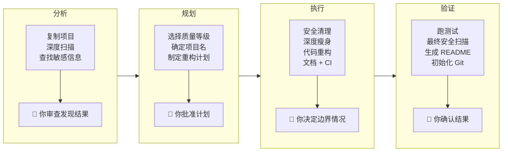

<p align="center">
  
</p>

<h1 align="center">all-project-auto-to-opensource</h1>

<p align="center">
  <b>把任何乱糟糟的代码库一步变成高质量、可维护的项目。</b>
</p>

<p align="center">
  <a href="README.md">English</a> | <a href="README_CN.md">中文</a>
</p>

---

你有一个能跑的项目。也许它从 demo 开始，也许是一点点长出来的。现在里面堆满了死代码、没人看的测试文件、写死的路径、泄露的密钥，文件夹结构也一塌糊涂。

你想把它收拾干净——也许要开源，也许只是想让它好维护。但从「在我这能跑」到「别人也能上手」，中间的鸿沟巨大无比。

**这个 AI Skill 帮你自动跨过这道鸿沟。**

## 它到底做什么

给它任何项目——任何语言、任何框架——它会：

- **剥掉不该有的东西** — 废弃文件、死代码、仅内部使用的工具函数、引用了公司内部资源的测试数据
- **找出不能公开的东西** — API 密钥、令牌、内网 IP、员工姓名、写死的路径——遍历每个文件，包括你忘了的那些
- **按行业标准重构** — 规范的目录结构、干净的导入关系、合理的命名、LICENSE、CONTRIBUTING、CI 配置
- **基于最终代码生成文档** — README、API 文档、架构说明——写的是*代码实际的样子*，不是你以为的样子
- **全程验证** — 测试必须通过、安全扫描必须干净，才会进入下一步

最终结果：你的项目看起来像是一个有纪律的团队从第一天就在认真做。

## 适合谁

| 场景 | 你会得到什么 |
|------|------------|
| **「我想把副业项目开源」** | 密钥清除、代码精简、README 自动生成，直接可以发布 |
| **「这个内部工具太乱了」** | 死代码清理、结构规范化，可维护性大幅提升 |
| **「我接手了一个代码库」** | 搞清楚哪些有用、剥掉哪些没用，得到一个干净的起点 |
| **「我的 demo 要变成正式产品」** | 从原型混乱到生产级结构，分钟搞定 |

## 安装

```bash
npx skills add breath57/all-project-auto-to-opensource/skills/cn
```

## 工作原理

Skill 执行 8 阶段工作流，设有 5 个强制检查点——每个关键决策由你做主。



### 3 个质量等级

| 等级 | 范围 | 适合 |
|------|------|------|
| **L1 基础** | 安全清理 + LICENSE + README + .gitignore | 快速发布、内部工具 |
| **L2 标准** | L1 + 代码整理 + 测试 + CI + CONTRIBUTING | 大多数项目 |
| **L3 专业** | L2 + API 文档 + 架构文档 + 示例 + 徽章 | 库、框架 |

### AI 绝不擅自决定的事

在每个检查点，AI 都会停下来等你：

1. **分析** — 展示发现了什么（密钥、死代码、内部引用）。你判断哪些是真的问题。
2. **等级与命名** — 你选 L1/L2/L3，你定项目名。
3. **重构计划** — 你看到每一项即将发生的改动，确认后才执行。
4. **边界情况** — 拿不准的文件？你来决定留还是删。
5. **最终审查** — 测试通过、扫描干净，你确认后才生成 README。

## 安全

- 多层密钥扫描 — API 密钥、令牌、密码、连接字符串、云服务商凭证、PEM 证书
- 内部引用检测 — 企业 URL、内网 IP、写死的路径、员工姓名
- 感知 .gitignore — 不会误删已受保护的文件
- 二次验证 — 所有修改完成后再跑一次完整安全扫描

## 贡献

欢迎提交 Issue、改进建议与功能请求。

## 许可证

MIT — 详见 [LICENSE](LICENSE)。
