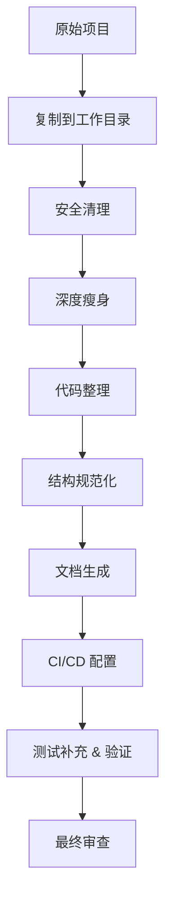

# 追踪文件模板

在 `$TARGET_DIR/` 中创建的追踪文件模板。

---

## .process.json

```json
{
  "status": "in-progress",
  "project_name": "",
  "target_level": "L2",
  "started_at": "",
  "completed_at": null,
  "current_phase": 5,
  "current_step": "5.1",
  "total_steps": 0,
  "completed_steps": 0,
  "phases": [
    {
      "id": 5,
      "name": "执行重构",
      "status": "not-started",
      "steps": [
        {
          "id": "5.1",
          "action": "安全清理 - 清理硬编码密钥",
          "status": "not-started",
          "note": "",
          "files_affected": []
        }
      ]
    }
  ],
  "anti_drift_log": []
}
```

### 状态值
- `"not-started"` — 未开始
- `"in-progress"` — 进行中
- `"completed"` — 已完成
- `"skipped"` — 已跳过（必须附 note 说明原因）
- `"blocked"` — 阻塞

### anti_drift_log 格式
```json
{"timestamp": "...", "phase": 5, "step": "5.3", "on_track": true, "note": ""}
```

---

## .checklist.json

```json
{
  "status": "pending",
  "checked_at": null,
  "items": [
    {"category": "安全", "check": "代码中无 API 密钥或令牌", "passed": null},
    {"category": "安全", "check": "无硬编码内部 URL", "passed": null},
    {"category": "安全", "check": ".gitignore 覆盖所有敏感文件", "passed": null},
    {"category": "License", "check": "LICENSE 文件存在", "passed": null},
    {"category": "文档", "check": "README.md 完整且准确", "passed": null},
    {"category": "构建", "check": "项目可从干净克隆构建", "passed": null},
    {"category": "测试", "check": "测试套件通过", "passed": null},
    {"category": "测试", "check": "关键模块有测试覆盖", "passed": null},
    {"category": "瘦身", "check": "无内部专用代码残留", "passed": null},
    {"category": "瘦身", "check": "无冗余/过时文件残留", "passed": null},
    {"category": "瘦身", "check": "无冗余/过时测试用例", "passed": null},
    {"category": "gitignore", "check": ".gitignore 覆盖所有生成文件", "passed": null},
    {"category": "结构", "check": "无空目录", "passed": null},
    {"category": "依赖", "check": "无未使用的依赖", "passed": null},
    {"category": "CI", "check": "CI 配置有效", "passed": null}
  ]
}
```

检查项应根据目标级别和计划内容进行调整。

---

## .plan.md 结构模板

````markdown
# 开源化重构计划

## 项目摘要
- 名称：...
- 类型：...
- 目标级别：L1/L2/L3

## 架构概览（Mermaid）



## 详细步骤

### 步骤 1: 安全清理
- [ ] 清理代码中的硬编码敏感信息
- [ ] 创建 .env.example（如适用）
- [ ] 确保 .gitignore 覆盖敏感文件

### 步骤 2: 深度瘦身
- [ ] 文件级瘦身：{待删除文件列表}
- [ ] 代码逻辑瘦身：{待清理逻辑列表}
- [ ] 测试瘦身：{待清理测试列表}

### 步骤 3: 代码整理
- [ ] 移除死代码
- [ ] ...

（... 所有步骤包含文件级细节 ...）

## 文件操作摘要

### 需要删除的文件
（列表 + 原因。被 .gitignore 保护的文件不在此列）

### 需要创建的文件
（列表 + 描述）

### 需要修改的文件
（列表 + 变更摘要）

## 风险评估
（可能出问题的地方）

## 测试验证计划
（重构完成后如何验证一切正常）
````
