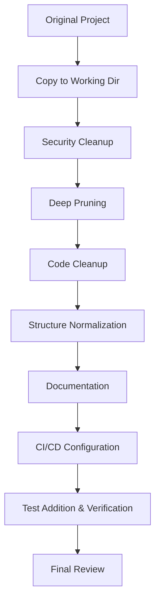

# Tracking File Templates

Templates for tracking files created in `$TARGET_DIR/`.

---

## .process.json

```json
{
  "status": "in-progress",
  "project_name": "",
  "target_level": "L2",
  "started_at": "",
  "completed_at": null,
  "current_phase": 5,
  "current_step": "5.1",
  "total_steps": 0,
  "completed_steps": 0,
  "phases": [
    {
      "id": 5,
      "name": "Execute Refactor",
      "status": "not-started",
      "steps": [
        {
          "id": "5.1",
          "action": "Security Cleanup - Clean hardcoded secrets",
          "status": "not-started",
          "note": "",
          "files_affected": []
        }
      ]
    }
  ],
  "anti_drift_log": []
}
```

### Status Values
- `"not-started"` — Not started
- `"in-progress"` — In progress
- `"completed"` — Completed
- `"skipped"` — Skipped (must include note with reason)
- `"blocked"` — Blocked

### anti_drift_log Format
```json
{"timestamp": "...", "phase": 5, "step": "5.3", "on_track": true, "note": ""}
```

---

## .checklist.json

```json
{
  "status": "pending",
  "checked_at": null,
  "items": [
    {"category": "Security", "check": "No API keys or tokens in code", "passed": null},
    {"category": "Security", "check": "No hardcoded internal URLs", "passed": null},
    {"category": "Security", "check": ".gitignore covers all sensitive files", "passed": null},
    {"category": "License", "check": "LICENSE file exists", "passed": null},
    {"category": "Docs", "check": "README.md is complete and accurate", "passed": null},
    {"category": "Build", "check": "Project builds from clean clone", "passed": null},
    {"category": "Tests", "check": "Test suite passes", "passed": null},
    {"category": "Tests", "check": "Critical modules have test coverage", "passed": null},
    {"category": "Pruning", "check": "No internal-only code remains", "passed": null},
    {"category": "Pruning", "check": "No redundant/outdated files remain", "passed": null},
    {"category": "Pruning", "check": "No redundant/outdated test cases", "passed": null},
    {"category": "gitignore", "check": ".gitignore covers all generated files", "passed": null},
    {"category": "Structure", "check": "No empty directories", "passed": null},
    {"category": "Dependencies", "check": "No unused dependencies", "passed": null},
    {"category": "CI", "check": "CI config is valid", "passed": null}
  ]
}
```

Check items should be adjusted based on target level and planned scope.

---

## .plan.md Structure Template

````markdown
# Open-Source Refactor Plan

## Project Summary
- Name: ...
- Type: ...
- Target Level: L1/L2/L3

## Architecture Overview (Mermaid)



## Detailed Steps

### Step 1: Security Cleanup
- [ ] Clean hardcoded sensitive info from code
- [ ] Create .env.example (if applicable)
- [ ] Ensure .gitignore covers sensitive files

### Step 2: Deep Pruning
- [ ] File-level pruning: {files to delete list}
- [ ] Code-logic pruning: {logic to clean list}
- [ ] Test pruning: {tests to clean list}

### Step 3: Code Cleanup
- [ ] Remove dead code
- [ ] ...

(... all steps with file-level detail ...)

## File Operation Summary

### Files to Delete
(List + reasons. Files protected by .gitignore not included)

### Files to Create
(List + descriptions)

### Files to Modify
(List + change summaries)

## Risk Assessment
(What might go wrong)

## Test Verification Plan
(How to verify everything works after refactoring)
````
